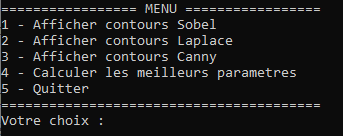
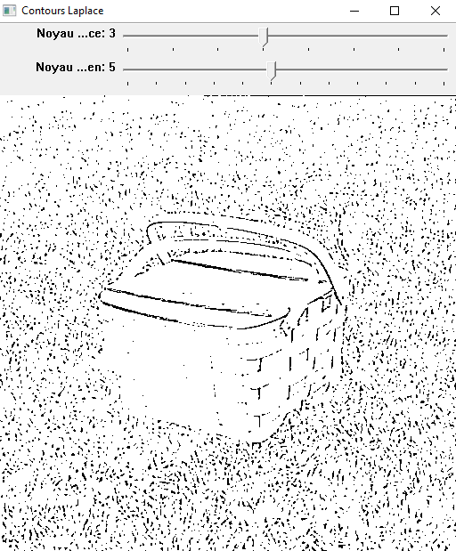
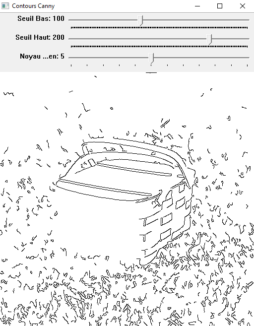

# Introduction

L'objectif de ce TP est de comparer trois détecteurs de contours : Sobel, Laplace et Canny. À travers un lot de 40 images, j'ai ajusté leurs paramètres pour optimiser la détection des contours et les ai comparés à des contours de référence tracés manuellement. Les performances ont été évaluées à l’aide de trois métriques : la performance, le taux de faux positifs et le taux de faux négatifs. Cette étude permet d’identifier les forces et limites de chaque méthode.

# 1. Présentation théorique des détecteurs utilisés

### 1.1 Détecteur de Sobel

Le détecteur de Sobel est une méthode de détection de contours basée sur le calcul des dérivées premières dans les directions horizontales et verticales. Il utilise des filtres de convolution pour approximer les dérivées partielles de l’image, permettant ainsi de détecter les changements brusques d’intensité.

L’opérateur de Sobel utilise un noyau de convolution, généralement de taille 3x3, 5x5 ou 7x7, appliqué à l’image pour extraire les contours. Il est souvent utilisé avec un flou gaussien pour réduire le bruit.

Formule de base :

- \( G_x = I * S_x \) (Gradient horizontal)
- \( G_y = I * S_y \) (Gradient vertical)
- \( G = \sqrt{G_x^2 + G_y^2} \) (Magnitude du gradient)

où \( S_x \) et \( S_y \) sont les noyaux de convolution pour les dérivées en \( x \) et \( y \).


### 1.2 Détecteur de Laplace

Le détecteur de Laplace repose sur le calcul de la dérivée seconde de l’image, ce qui permet de repérer les changements rapides d’intensité en détectant les zones de transition entre les contours et le fond. Contrairement à Sobel, qui utilise les dérivées premières, Laplace combine les dérivées secondes pour identifier directement les points de variation maximale.

L’opérateur de Laplacien est défini comme suit :

\( \Delta I = \frac{\partial^2 I}{\partial x^2} + \frac{\partial^2 I}{\partial y^2} \)

où \( I \) est l’image d’entrée.

Il est souvent utilisé avec un flou gaussien pour minimiser le bruit.


### 1.3 Détecteur de Canny
L’algorithme de Canny est une méthode avancée de détection de contours qui combine plusieurs étapes :

1. Flou gaussien pour réduire le bruit.
2. Calcul des gradients avec l’opérateur de Sobel.
3. Suppression des non-maxima pour ne garder que les pixels où le gradient est maximal.
4. Seuil double et hystérésis pour relier les contours détectés et supprimer les faux positifs.

Canny permet une meilleure détection des contours et offre des résultats plus précis en ajustant deux seuils : un seuil bas et un seuil haut.


# 2. Explication des fonctions d’OpenCV utilisées

Les trois détecteurs ont été implémentés à l’aide des fonctions OpenCV suivantes :

- **Détection de Sobel :** `cv::Sobel(image, gradient, ddepth, dx, dy, ksize)`
  - `ddepth` : profondeur de l’image de sortie.
  - `dx, dy` : ordre de la dérivation (1 pour x, 0 pour y et inversement).
  - `ksize` : taille du noyau de Sobel (1, 3, 5 ou 7).


- **Détection de Laplace :** `cv::Laplacian(image, laplace, ddepth, ksize)`
  - `ddepth` : profondeur de l’image.
  - `ksize` : taille du noyau (généralement 1, 3, 5).


- **Détection de Canny :** `cv::Canny(image, contours, threshold1, threshold2)`
  - `threshold1` : seuil bas pour l’hystérésis.
  - `threshold2` : seuil haut.

Pour éviter les faux contours dus au bruit, un flou gaussien a été appliqué avant chaque opération en utilisant :

```cv::GaussianBlur(image, image, cv::Size(tailleNoyauGaussien, tailleNoyauGaussien), 1.0);```

# 3. Présentation du programme

Le programme développé permet d’analyser et de comparer trois méthodes de détection de contours : Sobel, Laplace et Canny. Il offre également une fonctionnalité permettant de calculer automatiquement les meilleurs paramètres pour chaque méthode en testant différentes configurations sur un lot d’images de référence.

### 3.1 Compilation et exécution

**Sur Windows :**

Pour compiler le programme sous Windows, il suffit d’exécuter la commande suivante dans un terminal :

```
make
```

**Sur macOS :**

Avant de compiler sur macOS, il est nécessaire de modifier le fichier Makefile. À la ligne 22, remplacer :

```
-lopencv_core4100 -lopencv_imgcodecs4100 -lopencv_highgui4100 -lopencv_imgproc4100 -lopencv_features2d4100
```

par

```
`pkg-config --cflags --libs opencv4`
```

Puis, exécuter la commande suivante :

```
make
```

Une fois la compilation terminée, un fichier exécutable "main" est généré.


### 3.2 Navigation dans le programme

Une fois exécuté, le programme affiche un menu interactif dans le terminal :



L'utilisateur peut sélectionner une option en entrant un chiffre entre **1** et **5**.


### 3.3 Affichage des contours avec Sobel, Laplace et Canny

Si l'utilisateur sélectionne l'une des trois premières options, une fenêtre s'ouvre, affichant l’image d’origine transformée avec la méthode de détection de contours choisie.

- **Navigation entre les images :**
  - Touche q : Affiche l’image précédente
  - Touche d : Affiche l’image suivante
  - Touche Échap (Esc) : Retour au menu principal
  
  
- **Modification des paramètres en temps réel :**
  - Chaque fenêtre contient des trackbars permettant de modifier les paramètres de la méthode sélectionnée (taille du noyau, seuils, etc.). L’image affichée est mise à jour dynamiquement en fonction des valeurs définies par l’utilisateur.


 

 




### 3.4 Calcul des meilleurs paramètres

L'option **4 - Calculer les meilleurs paramètres** exécute une analyse automatique sur les 40 images en testant différentes valeurs de paramètres pour chaque méthode.

- Le programme compare les résultats obtenus à des contours de référence dessinés à la main.
- Il sélectionne les meilleurs paramètres en fonction des performances mesurées.
- À la fin du processus, quatre fichiers CSV sont générés :
  - MeilleursParametresSobel.csv
  - MeilleursParametresLaplace.csv
  - MeilleursParametresCanny.csv
  - Moyennes.csv (résumé global des meilleures valeurs)
  
Ces fichiers contiennent les meilleurs paramètres trouvés ainsi que les performances associées pour chacune des 40 images testées.

# 4. Résumé des valeurs mesurées

Grâce à une fonction que j'ai codée, j'ai pu déterminer les meilleurs paramètres pour chaque méthode en les testant de manière exhaustive. Cette fonction compare les performances obtenues et sélectionne, pour chaque image, les paramètres offrant le meilleur résultat. Une fois ces paramètres optimaux identifiés pour chaque image, j'ai calculé leur moyenne afin d'obtenir une estimation des valeurs à privilégier en premier pour espérer un bon résultat général.

Le tableau suivant présente ces moyennes, regroupant les paramètres et performances mesurées pour chaque détecteur de contours. Il permet ainsi d’orienter le choix des paramètres à tester en priorité lors d’une nouvelle détection de contours.

| Description              | Sobel  | Laplace | Canny  |
|--------------------------|--------|---------|--------|
| **Taille Noyau Sobel**   | 1      | -       | -      |
| **Taille Noyau Gaussien**| 7      | 5       | 7      |
| **Seuil Bas (Canny)**    | -      | -       | 225    |
| **Seuil Haut (Canny)**   | -      | -       | 250    |
| **Performance (\( P \)) ** | 1.0132 | 1.0224  | 1.01608 |
| **Taux Faux Positifs (\( TFP \)) ** | 0  | 0   | 0      |
| **Taux Faux Négatifs (\( TFN \)) ** | -0.0132 | -0.0224 | -0.0161 |


# 5. Interprétation et comparaison des résultats

- **Comparaison des performances :**
  - Les trois détecteurs affichent une performance globale proche de 1 avec un léger avantage pour Laplace (1.0224).
  - Canny suit avec 1.01608 et Sobel est légèrement en retrait (1.0132).
  - Ces valeurs montrent que tous les détecteurs ont été bien optimisés avec les bons paramètres.


- **Analyse des faux positifs :**
  - Tous les détecteurs ont un taux de faux positifs de 0, ce qui signifie qu’ils ne détectent pas de contours erronés dans les images.
  - Analyse des faux négatifs :


- **Laplace affiche le taux le plus élevé de faux négatifs (−0.0224), ce qui signifie qu’il manque davantage de contours par rapport aux autres méthodes.**
  - Canny a un faux négatif plus faible (−0.0161), indiquant qu’il est plus précis pour capter les contours corrects.
  - Sobel est le plus performant en termes de faux négatifs (−0.0132), détectant une majorité des contours réels.
  
  
- **Effet du flou gaussien :**
  - L’ajout d’un flou gaussien a permis d’améliorer la détection en réduisant les erreurs dues au bruit, en particulier pour Sobel et Laplace.
  
  
- **Bilan global :**
  - Laplace obtient la meilleure performance globale, mais son taux de faux négatifs est plus élevé, ce qui signifie qu’il peut manquer certains contours.
  - Canny est bien équilibré, avec une très bonne détection et peu d’erreurs.
  - Sobel est efficace, mais détecte moins de contours que Canny tout en restant plus précis que Laplace.


# Conclusion : Quel détecteur choisir ?
- Si l’on veut maximiser la détection des contours : choisir Laplace.
- Si l’on veut une bonne précision tout en minimisant les erreurs : choisir Canny.
- Si l’on veut une méthode simple et rapide avec de bons résultats : choisir Sobel.

Pour une analyse plus approfondie, les fichiers CSV générés pour chaque méthode contiennent les meilleurs paramètres et les performances associées pour chacune des 40 images. Ces données offrent une base plus détaillée pour ajuster les détecteurs en fonction des spécificités des images traitées.

